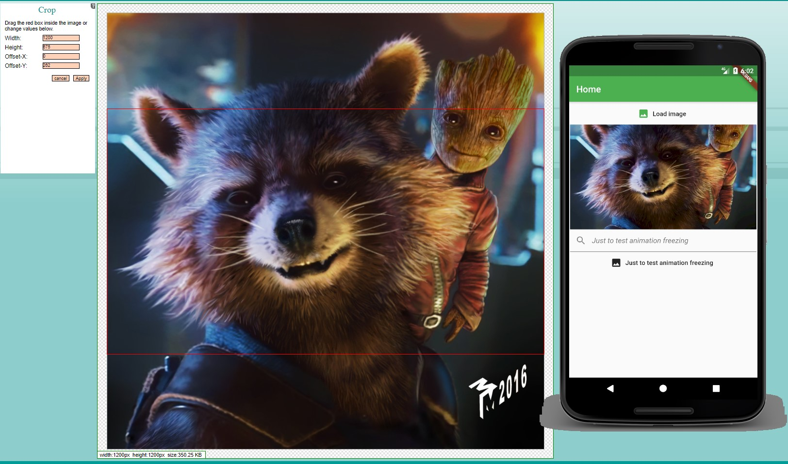
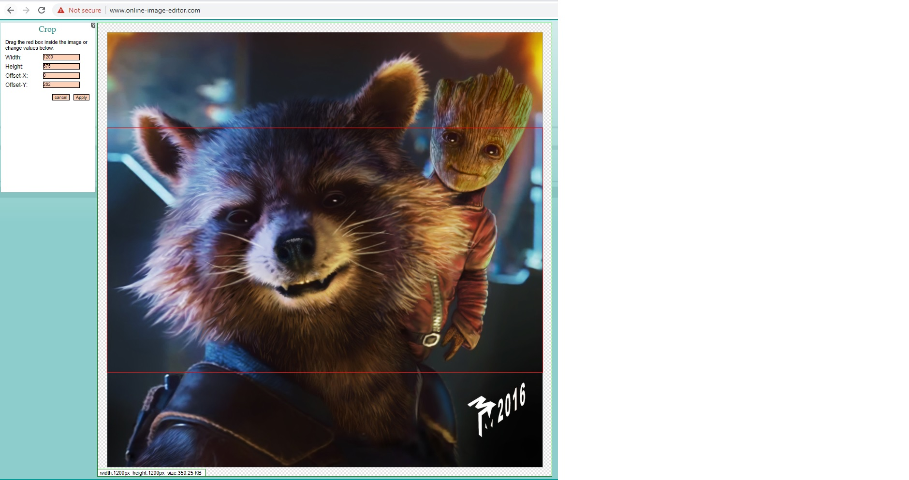

# image_resizer

A simple Flutter project for demonstrate image resizing. Formats - original, 16/9, 4/3

Project using: rxDart, BLoC pattern, https://app.quicktype.io/#l=dart for quick generating models, ui Canvas for changing ratio

example original image: 1920*1920 px

double ratioX = 1200 / 1920 = 0.625;
double ratioY = 1200 / 1920 = 0.625
double ratio = math.min(0.625, 0.625) = 0.625;

nextWidth = 1920 * 0.625 = 1200;
nextHeight = 1920 * 0.625 = 1200;

formattedWidth = 1200
formattedHeight = 1200*9/16 = 675

offsetX = 0
offsetY = (1200 - 675)/2 = 262.5
